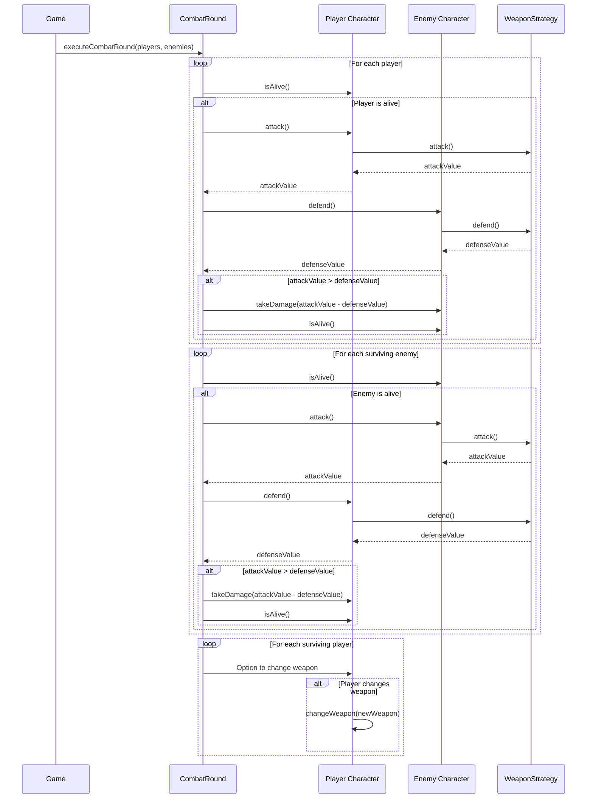

# Sequenzdiagramm Rollenspiel

```mermaid
sequenceDiagram
    participant Game
    participant CombatRound
    participant PC as Player Character
    participant Enemy as Enemy Character
    participant WeaponStrategy

    Game->>CombatRound: executeCombatRound(players, enemies)
    loop For each player
        CombatRound->>PC: isAlive()
        alt Player is alive
            CombatRound->>PC: attack()
            PC->>WeaponStrategy: attack()
            WeaponStrategy-->>PC: attackValue
            PC-->>CombatRound: attackValue
            
            CombatRound->>Enemy: defend()
            Enemy->>WeaponStrategy: defend()
            WeaponStrategy-->>Enemy: defenseValue
            Enemy-->>CombatRound: defenseValue
            
            alt attackValue > defenseValue
                CombatRound->>Enemy: takeDamage(attackValue - defenseValue)
                CombatRound->>Enemy: isAlive()
            end
        end
    end
    
    loop For each surviving enemy
        CombatRound->>Enemy: isAlive()
        alt Enemy is alive
            CombatRound->>Enemy: attack()
            Enemy->>WeaponStrategy: attack()
            WeaponStrategy-->>Enemy: attackValue
            Enemy-->>CombatRound: attackValue
            
            CombatRound->>PC: defend()
            PC->>WeaponStrategy: defend()
            WeaponStrategy-->>PC: defenseValue
            PC-->>CombatRound: defenseValue
            
            alt attackValue > defenseValue
                CombatRound->>PC: takeDamage(attackValue - defenseValue)
                CombatRound->>PC: isAlive()
            end
        end
    end
    
    loop For each surviving player
        CombatRound->>PC: Option to change weapon
        alt Player changes weapon
            PC->>PC: changeWeapon(newWeapon)
        end
    end
```
