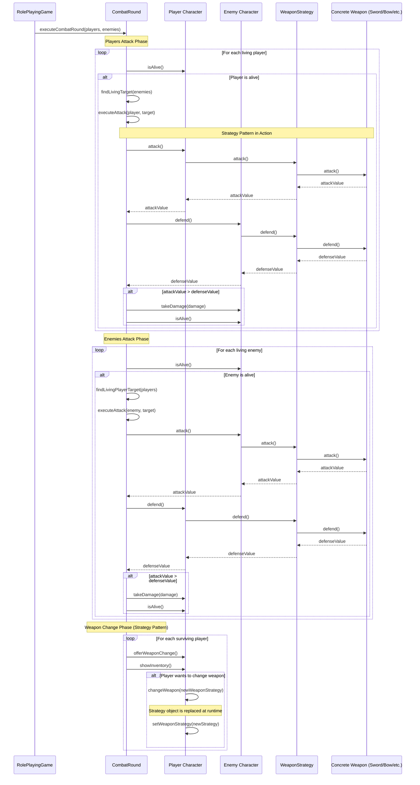
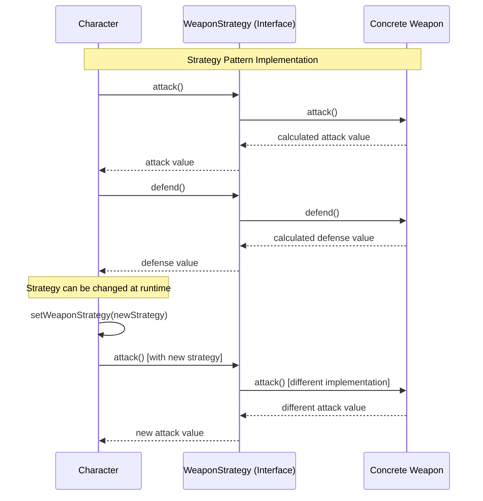

# Sequenzdiagramm Rollenspiel - Strategy Pattern Implementation

## Combat Round Sequence

```mermaid
sequenceDiagram
    participant Game as RolePlayingGame
    participant CombatRound
    participant PC as Player Character
    participant Enemy as Enemy Character
    participant WeaponStrategy
    participant ConcreteWeapon as Concrete Weapon (Sword/Bow/etc.)

    Game->>CombatRound: executeCombatRound(players, enemies)
    
    Note over CombatRound: Players Attack Phase
    loop For each living player
        CombatRound->>PC: isAlive()
        alt Player is alive
            CombatRound->>CombatRound: findLivingTarget(enemies)
            CombatRound->>CombatRound: executeAttack(player, target)
            
            Note over CombatRound,ConcreteWeapon: Strategy Pattern in Action
            CombatRound->>PC: attack()
            PC->>WeaponStrategy: attack()
            WeaponStrategy->>ConcreteWeapon: attack()
            ConcreteWeapon-->>WeaponStrategy: attackValue
            WeaponStrategy-->>PC: attackValue
            PC-->>CombatRound: attackValue
            
            CombatRound->>Enemy: defend()
            Enemy->>WeaponStrategy: defend()
            WeaponStrategy->>ConcreteWeapon: defend()
            ConcreteWeapon-->>WeaponStrategy: defenseValue
            WeaponStrategy-->>Enemy: defenseValue
            Enemy-->>CombatRound: defenseValue
            
            alt attackValue > defenseValue
                CombatRound->>Enemy: takeDamage(damage)
                CombatRound->>Enemy: isAlive()
            end
        end
    end
    
    Note over CombatRound: Enemies Attack Phase
    loop For each living enemy
        CombatRound->>Enemy: isAlive()
        alt Enemy is alive
            CombatRound->>CombatRound: findLivingPlayerTarget(players)
            CombatRound->>CombatRound: executeAttack(enemy, target)
            
            CombatRound->>Enemy: attack()
            Enemy->>WeaponStrategy: attack()
            WeaponStrategy->>ConcreteWeapon: attack()
            ConcreteWeapon-->>WeaponStrategy: attackValue
            WeaponStrategy-->>Enemy: attackValue
            Enemy-->>CombatRound: attackValue
            
            CombatRound->>PC: defend()
            PC->>WeaponStrategy: defend()
            WeaponStrategy->>ConcreteWeapon: defend()
            ConcreteWeapon-->>WeaponStrategy: defenseValue
            WeaponStrategy-->>PC: defenseValue
            PC-->>CombatRound: defenseValue
            
            alt attackValue > defenseValue
                CombatRound->>PC: takeDamage(damage)
                CombatRound->>PC: isAlive()
            end
        end
    end
    
    Note over CombatRound: Weapon Change Phase (Strategy Pattern)
    loop For each surviving player
        CombatRound->>PC: offerWeaponChange()
        CombatRound->>PC: showInventory()
        alt Player wants to change weapon
            PC->>PC: changeWeapon(newWeaponStrategy)
            Note over PC: Strategy object is replaced at runtime
            PC->>PC: setWeaponStrategy(newStrategy)
        end
    end
```

## Strategy Pattern Class Interaction

```mermaid
sequenceDiagram
    participant Client as Character
    participant Context as WeaponStrategy (Interface)
    participant ConcreteStrategy as Concrete Weapon

    Note over Client,ConcreteStrategy: Strategy Pattern Implementation
    
    Client->>Context: attack()
    Context->>ConcreteStrategy: attack()
    ConcreteStrategy-->>Context: calculated attack value
    Context-->>Client: attack value
    
    Client->>Context: defend()
    Context->>ConcreteStrategy: defend()
    ConcreteStrategy-->>Context: calculated defense value
    Context-->>Client: defense value
    
    Note over Client: Strategy can be changed at runtime
    Client->>Client: setWeaponStrategy(newStrategy)
    Client->>Context: attack() [with new strategy]
    Context->>ConcreteStrategy: attack() [different implementation]
    ConcreteStrategy-->>Context: different attack value
    Context-->>Client: new attack value
```
