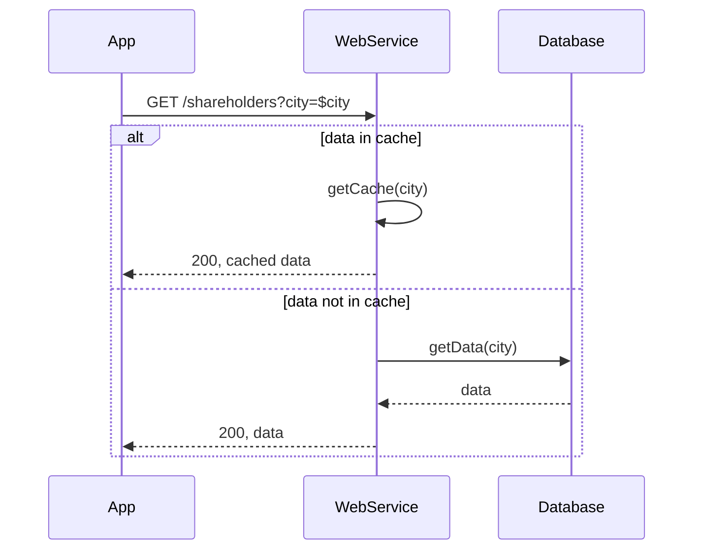

```mermaid
sequenceDiagram
    participant App
    participant WebService
    participant Database

    App->>WebService: GET /shareholders?city=$city
    alt data in cache
        WebService->>WebService: getCache(city)
        WebService-->>App: 200, cached data
    else data not in cache
        WebService->>Database: getData(city)
        Database-->>WebService: data
        WebService-->>App: 200, data
    end
```