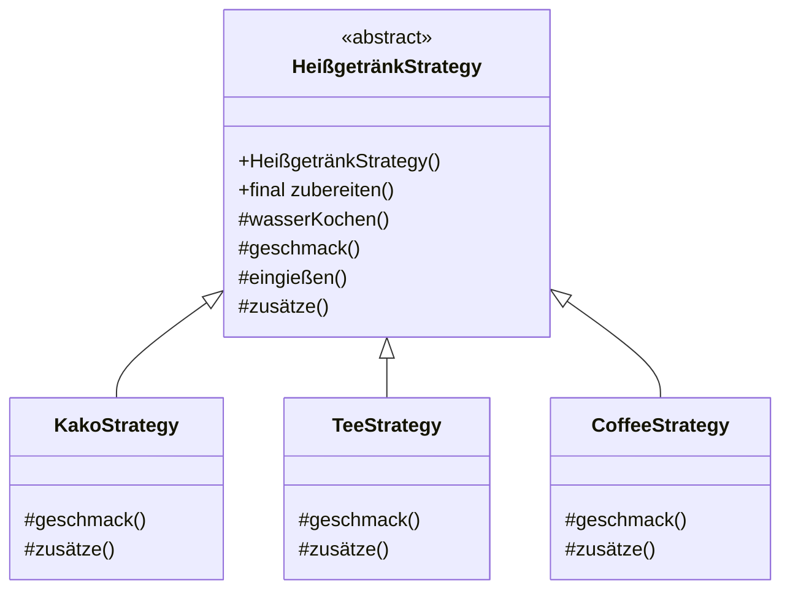

```mermaid
    classDiagram
        class HeißgetränkStrategy {
            <<abstract>>
            +HeißgetränkStrategy()
            +final zubereiten()
            #wasserKochen()
            #geschmack()
            #eingießen()
            #zusätze()
        }
        class KakoStrategy {
            #geschmack()
            #zusätze()
        }
        class TeeStrategy {
            #geschmack()
            #zusätze()
        }
        class CoffeeStrategy {
            #geschmack()
            #zusätze()
        }
        HeißgetränkStrategy <|-- KakoStrategy
        HeißgetränkStrategy <|-- TeeStrategy
        HeißgetränkStrategy <|-- CoffeeStrategy
```