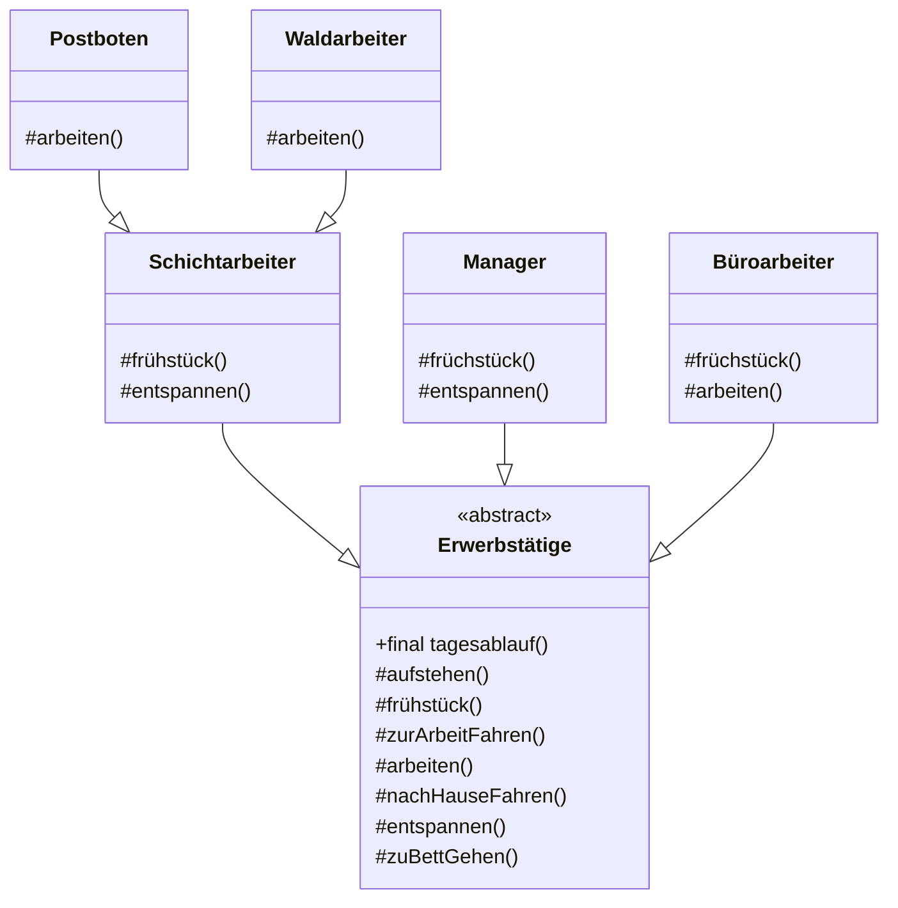

```mermaid
    classDiagram
        class Erwerbstätige {
            <<abstract>>
            +final tagesablauf()
            #aufstehen()
            #frühstück()
            #zurArbeitFahren()
            #arbeiten()
            #nachHauseFahren()
            #entspannen()
            #zuBettGehen()
        }
        
        class Schichtarbeiter {
            #frühstück()
            #entspannen()
        }
        
        class Büroarbeiter {
            #früchstück()
            #arbeiten()
        }
        
        class Manager {
            #früchstück()
            #entspannen()
        }
        
        class Waldarbeiter {
            #arbeiten()
        }
        
        class Postboten {
            #arbeiten()
        }

        Schichtarbeiter--|>Erwerbstätige
        Manager--|>Erwerbstätige
        Büroarbeiter--|>Erwerbstätige

        Postboten--|>Schichtarbeiter
        Waldarbeiter--|>Schichtarbeiter
```