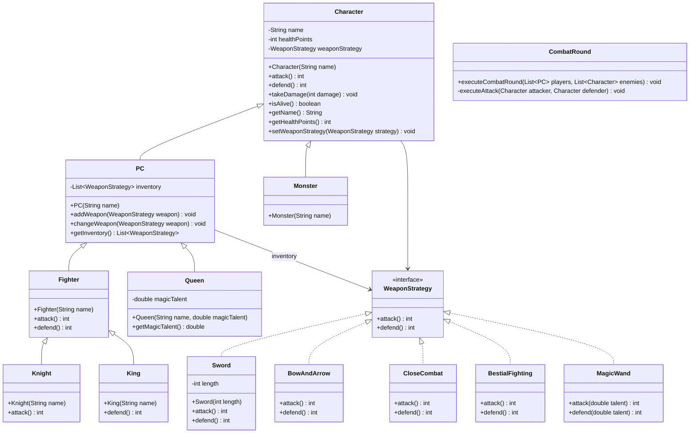

```mermaid
classDiagram
    class Character {
        -String name
        -int healthPoints
        -WeaponStrategy weaponStrategy
        +Character(String name)
        +attack() int
        +defend() int
        +takeDamage(int damage) void
        +isAlive() boolean
        +getName() String
        +getHealthPoints() int
        +setWeaponStrategy(WeaponStrategy strategy) void
    }

    class PC {
        -List~WeaponStrategy~ inventory
        +PC(String name)
        +addWeapon(WeaponStrategy weapon) void
        +changeWeapon(WeaponStrategy weapon) void
        +getInventory() List~WeaponStrategy~
    }

    class Fighter {
        +Fighter(String name)
        +attack() int
        +defend() int
    }

    class Knight {
        +Knight(String name)
        +attack() int
    }

    class King {
        +King(String name)
        +defend() int
    }

    class Queen {
        -double magicTalent
        +Queen(String name, double magicTalent)
        +getMagicTalent() double
    }

    class Monster {
        +Monster(String name)
    }

    class WeaponStrategy {
        <<interface>>
        +attack() int
        +defend() int
    }

    class Sword {
        -int length
        +Sword(int length)
        +attack() int
        +defend() int
    }

    class BowAndArrow {
        +attack() int
        +defend() int
    }

    class CloseCombat {
        +attack() int
        +defend() int
    }

    class BestialFighting {
        +attack() int
        +defend() int
    }

    class MagicWand {
        +attack(double talent) int
        +defend(double talent) int
    }

    class CombatRound {
        +executeCombatRound(List~PC~ players, List~Character~ enemies) void
        -executeAttack(Character attacker, Character defender) void
    }

    Character <|-- PC
    PC <|-- Fighter
    Fighter <|-- Knight
    Fighter <|-- King
    PC <|-- Queen
    Character <|-- Monster
    
    Character --> WeaponStrategy
    
    WeaponStrategy <|.. Sword
    WeaponStrategy <|.. BowAndArrow
    WeaponStrategy <|.. CloseCombat
    WeaponStrategy <|.. BestialFighting
    WeaponStrategy <|.. MagicWand
    
    PC --> WeaponStrategy : inventory
```